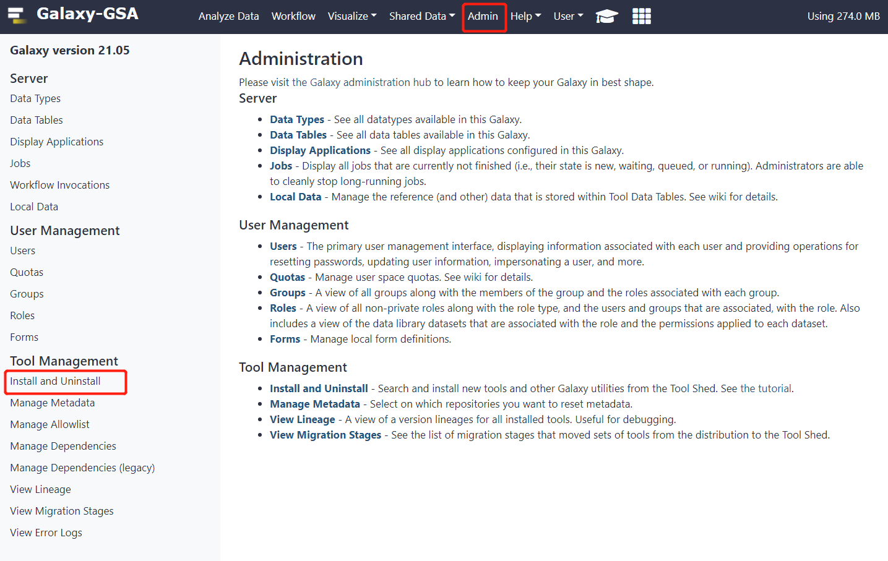
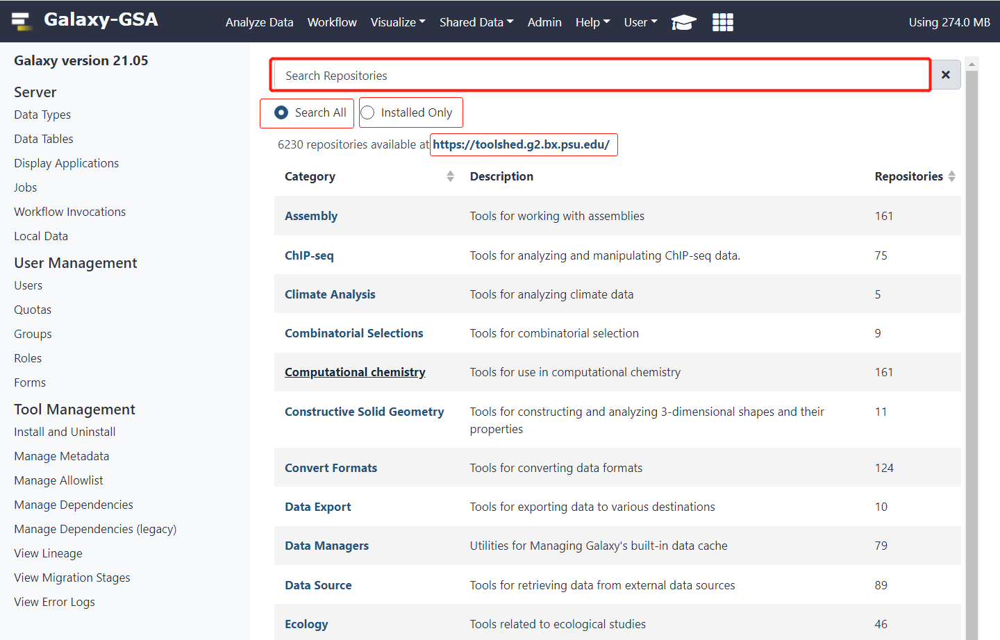
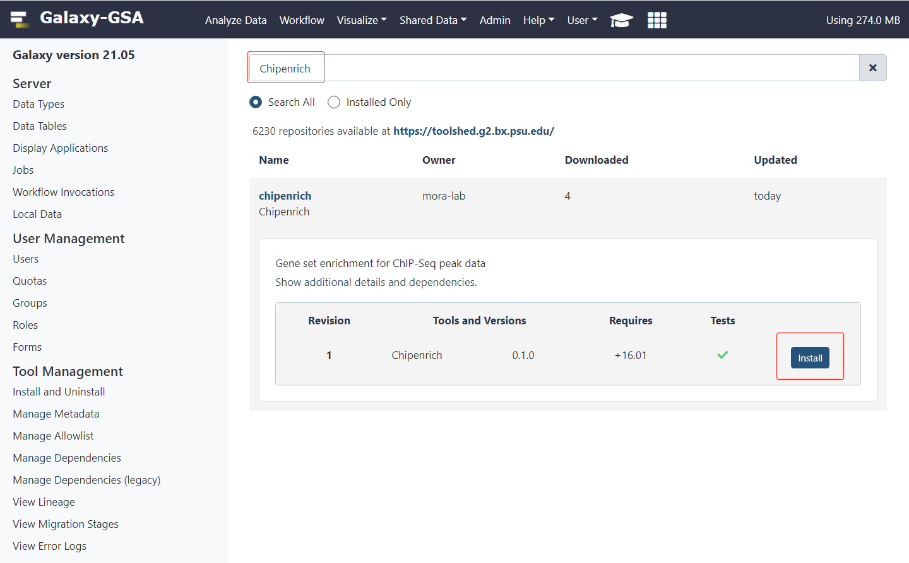
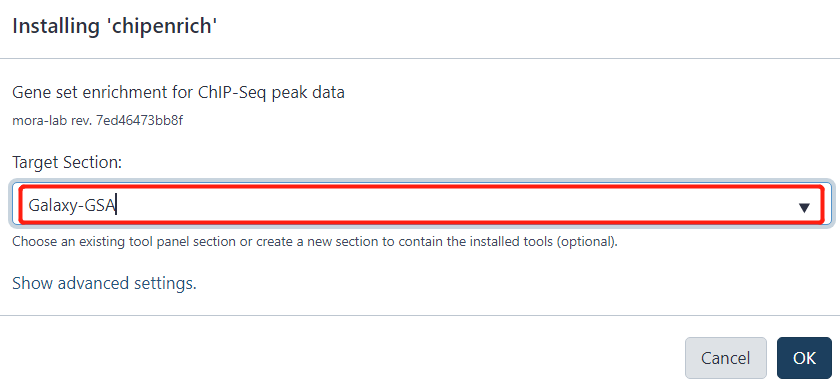
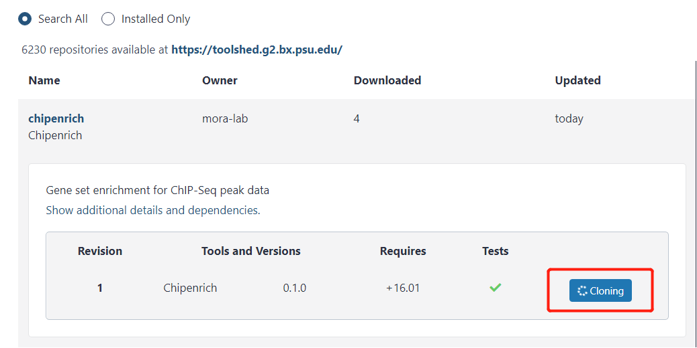
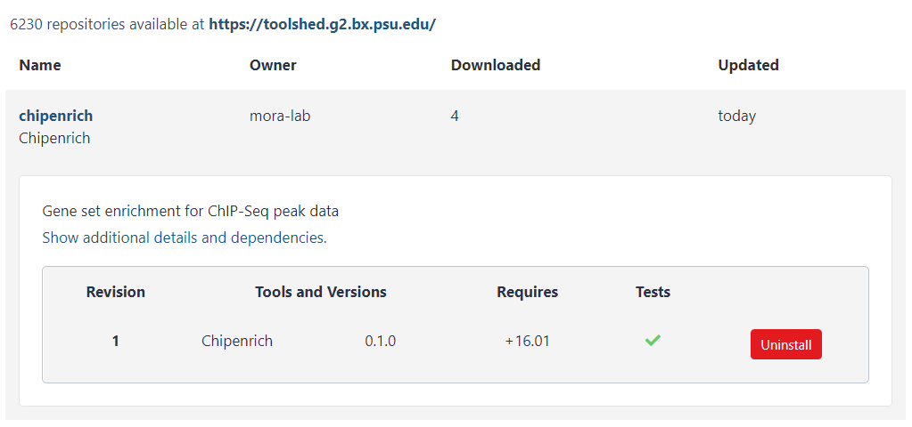

# Getting Galaxy-GSA tools from the toolshed

# Getting Galaxy-GSA tools from the toolshed

Before you install tools from the [Toolshed](https://toolshed.g2.bx.psu.edu/), you need to log in to your administrator account.    

In our VirtualBox and Docker's Galaxy-GSA, the administrator account is `galaxy` with password `galaxy`.    

After logging in to the administrator account, there is a `Admin` column in the top menu bar. After clicking, the following interface will appear.    

Click `Install and Uninstall` on the left to Install or Uninstall the tool.    

The default search box at the top provides a search for all tools in the Toolshed.  

The `Installed Only` option switches the page to the already Installed Tools page.  

Here, we search for `Chipenrich` and click `Install` to Install the `Chipenrich` tool.  

In the dialog box that is displayed, you can select the corresponding `Target Section` or create a new `Target Section`.  

Then the tool will be installed automatically.

More methods of installation tools for Galaxy-GSA can view https://galaxyproject.org/admin/tools/add-tool-from-toolshed-tutorial/.  

