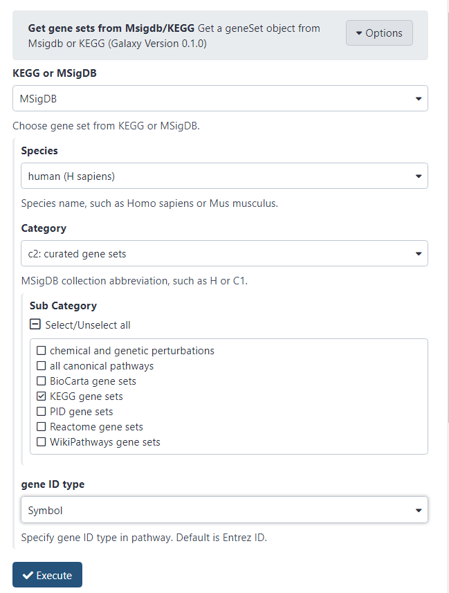
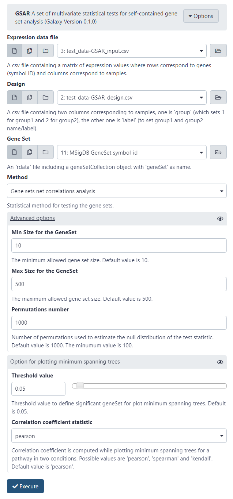
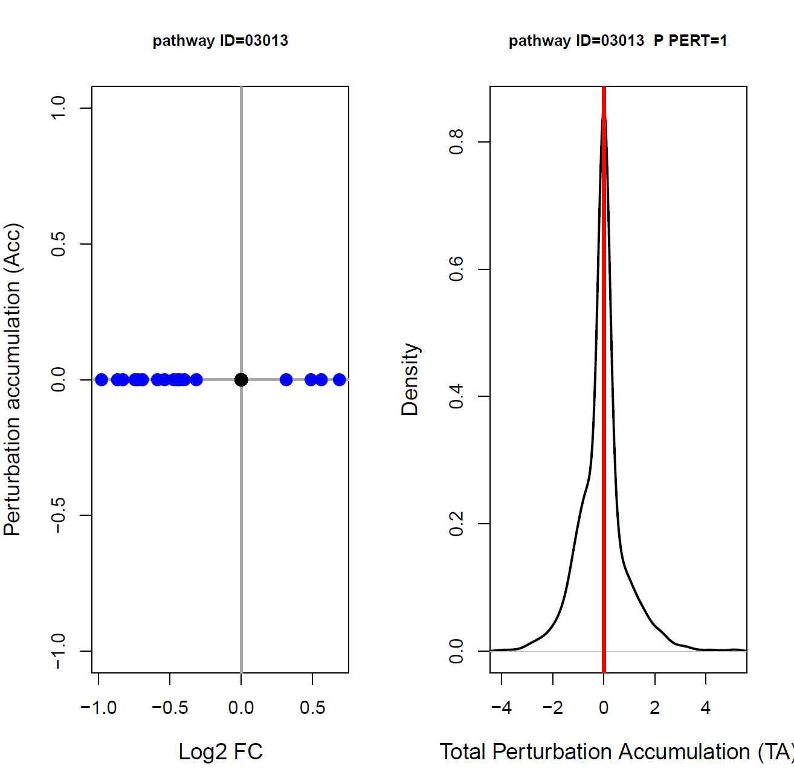
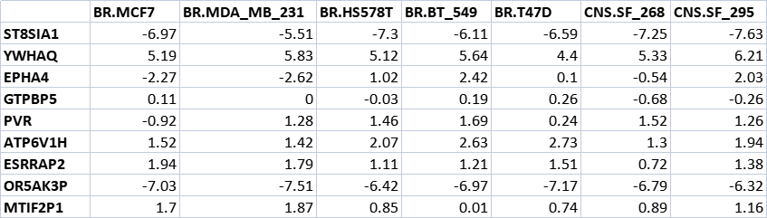

# Using Galaxy-GSA

We have three implementations of Galaxy-GSA and we assume that you are using one of them (how to install Galaxy-GSA? see https://gsa-central.github.io/galaxy.html):

- [Web server](http://moralab.science:8080/): Simply go to the website and use Galaxy-GSA. However, this web server does not allow account registration. If you use the web server, please save your data before the browser is closed.
- [VirtualBox](https://zenodo.org/record/5091193#.YOzsOuj7RCA): It does use `galaxy` as username and `galaxy` as password.
- [Docker](https://hub.docker.com/r/moralab/galaxy-gsa): It does use `galaxy` as username and `galaxy` as password.

For all three cases (the only exception being the `admin` menu), the interface of Galaxy-GSA looks like the following:

The left column contains all Galaxy tools. Under the `GALAXY-GSA` category, we have installed all the tools built by the `GALAXY-GSA` project and other GSA-related tools not built by us. All tools are wrappers of widely used R packages together with original R scripts. The right sidebar is the History, which is used to store your input data and results after each run of the tool. The middle bar is the interface for manipulating tools or editing files.

More information about Galaxy and learning materials can be found on the website https://training.galaxyproject.org/training-material/.

In this tutorial, we will focus on how to use Galaxy-GSA tools.

## Upload your files

Click the `upload` button in the upper left corner.

Click `Choose local files` and select the local files to upload. Here we upload all files used in this tutorial. These data files are available on [GitHub](https://github.com/gsa-central/galaxy-gsa/tree/main/test-data).

Click the `Start` button to upload.

When the color of the file in the History on the right turns to green, it means that the upload has been successful.

If you want to download data from the Internet, click 'Paste/Fetch Data', then paste the link of the file, and click 'Start' to download.

## Get gene sets from Msigdb/KEGG

This is a tool we built to get a `geneSetCollection` R object from the [MSigDB](https://www.gsea-msigdb.org/gsea/msigdb/) or [KEGG](https://www.genome.jp/kegg/) databases.

If the gene sets source is [KEGG](http://www.genome.jp/kegg/), it will only receive a KEGG organism code and output an `Rdata` file which has a `geneSet `object containing all KEGG pathways with their Entrez gene ID.

If the gene sets source is [MSigDB](http://software.broadinstitute.org/gsea/msigdb), you must assign specific species and categories to define the Gene Set collection. Again, the output is an `Rdata` file which has a `geneSet` object. The species from the MSigDB database are: Human, cattle, Roundworm, Dog, Zebrafish, fruit fly, chicken, House Mouse, Norway Rat, Baker's or Brewer's Yeast, and Pig.

Click `Get gene Sets from Msigdb/KEGG` on the left side. The tool interface is generally divided into *parameter selection* and *help documents*. The help document can help you know the details about this tool and its arguments.

As an example, let's download the gene sets for humans from KEGG, setting the arguments as follow:

> **KEGG or MSigDB**: `KEGG`
>
> **organism**: `hsa`  

If you want to get gene sets of other organism, you can get the organism code from https://www.kegg.jp/kegg/catalog/org_list.html.

At the end, click the button `Execute` to run this tool. 

After you run the Galaxy tool, you will see `GeneSet object from MSigDB/KEGG` in the `History`. When the color turns green, it means that the execution command of the tool has been successfully completed. If the color is red, there is a problem with the set parameters.

The `GeneSet object from MSigDB/KEGG` contains the gene sets for humans from KEGG. Click `edit attributes` to change its name, information, annotation, database, number of comment lines and other attributes. 

Here we change its name to `KEGG GeneSet entrez-id`.

Similarly, we can get the gene sets with symbol ID from MSigDB:

> **KEGG or MSigDB**: MSigDB
>
> **Species**: human (H sapiens)
>
> **Category**: c2: curated gene sets
>
> **Sub Category**: KEGG gene sets
>
> **gene ID type**: Symbol

Then we can change the result to `MSigDB GeneSet symbol-id`.

## ReactomePA

[Reactome](https://reactome.org/) is a free, open-source, curated and peer-reviewed pathway database. Its goal is to provide intuitive bioinformatics tools for the visualization, interpretation and analysis of pathway knowledge.

**ReactomePA** is a tool to enrich Significant Reactome Pathways with a list of differentially expressed genes.

This tool uses the function `enrichPathway `in the [ReactomePA](http://www.bioconductor.org/packages/release/bioc/html/ReactomePA.html) package. It supports the following organisms: human, rat, mouse, c.elegans, yeast, zebrafish and fly.

The **Differentially expressed gene list** of **ReactomePA** is a CSV file which includes a `DEgenes` column with Entrez ID.

**Set the following parameters:**

> **Differentially expressed gene list**: test_data-ReactomePA_input.csv
>
> **Organism**: human (H sapiens)

And Click `Execute` for the Gene Set Analysis.

If you want the gene ID to be converted to gene symbol, you need to set the parameter `Convert gene ID to SYMBOL` to `Yes`. This is located in `Advanced Options`.

The resulting `Significant_Reactome_Pathway_result` will appear in the `History`. It will be a CSV file, which you can look online or download to check with other software.

**Results**

The result table will look like the following table.

## GSAR

**GSAR (Gene Set Analysis in R)** is an R package which provides a set of multivariate statistical tests for self-contained gene set analysis (GSA). GSAR consists of two-sample multivariate nonparametric statistical methods testing a null hypothesis against specific alternative hypotheses, such as differences in mean (shift), variance (scale) or correlation structure. It also offers a graphical visualization tool for the correlation networks obtained from expression data to examine the change in the net correlation structure of a gene set between two conditions based on the minimum spanning trees.

GSAR tools have 5 methods.

- GSNCATest (Gene sets net correlations analysis)
- WWtest(Wald-Wolfowitz test)
- KStest(Kolmogorov-Smirnov test)
- MDtest(Mean Deviation test)
- RKStest(Radial Kolmogorov-Smirnov test)
- RMDtest(Radial Mean Deviation test)

These tools need three files as input. Two files with the gene expression data and its design, and one file with the result from `Get gene sets from Msigdb/KEGG`.

**Gene expression data**

The input is a csv file including a matrix of expression values where rows correspond to genes and columns correspond to samples. Recommended gene id is Symbol ID.

**Design**

A csv file that has two columns correspond to samples, one is `group` (which sets 1 for group1 and 2 for group2), the other one is 'label' (to set group1 and group2 name/label).

**Gene Sets**

**Gene Sets** is an `rdata` file including a `geneSet` variable that is a `geneSetCollection`object built by the `GSEABase` bioconductor package. You can use the **Get gene sets from Msigdb/KEGG** tool to get this file. You must pay attention to set the same gene id type as in the gene expression dataset.

**Set the following parameters:**

> **Expression data file**: test_data-GSAR_input.csv
>
> **Design**: test_data-GSAR_design.csv
>
> **Gene Set**: MSigDB GeneSet symbol-id
>
> **Method**: Gene sets net correlations analysis

**Results**

The results are `GSAR_Significant_pathway_plot` and `GSAR_p_value_for_the_geneSet`.

`GSAR_Significant_pathway_plot` is a PDF file with plots of minimum spanning trees for significant gene sets in two conditions.

`GSAR_p_value_for_the_geneSet` is a csv file containing the P-values of all gene sets.

## GSVA

**GSVA** is a Gene Set Analysis R package that estimates variation of pathway activity over a sample population in an unsupervised manner. This tool includes four methods to analyze microarray and RNA-seq data.

- **GSVA**: Gene Set Variation Analysis (GSVA) calculates sample-wise gene set enrichment scores as a function of genes inside and outside the gene set, analogously to a competitive gene set test. And it estimates variation of gene set enrichment over the samples independently of any class label.
- **PLAGE**: Pathway Level analysis of Gene Expression (PLAGE) standardizes each gene expression profile over the samples and then estimates the pathway activity profiles for each gene set as the coefficients of the first right-singular vector of the singular value.
- **z-score**: The combined z-score method also standardizes each gene expression profile into z-scores and combine the individual gene z-scores per sample to pathway activity profile.
- **ssGSEA**: The ssGSEA method uses the difference in empirical cumulative distribution functions of gene expression rank inside and outside the gene set to calculate an enrichment statistic per sample which is further normalized by the range of values taken throughout all gene sets and samples.

You must input **gene expression data** and **Gene sets** to run this tool.

**Gene expression data**

A csv file including a matrix of expression values where rows correspond to genes and columns correspond to samples. Recommended gene id is Entrez ID.

**Gene Sets**

**Gene Sets** is an `rdata` file including a `geneSet` variable that is a `geneSetCollection`object built by the `GSEABase` bioconductor package. You can use the **Get gene sets from Msigdb/KEGG** tool to get this file. You must pay attention to set the same gene id type as in the gene expression dataset.

**Set the following parameters:**

> **Gene expression data**: test_data-gsva_input.csv
>
> **Gene Sets**: KEGG GeneSet entrez-id
>
> **Method**：GSVA
>
> **Heatmap file type**：PNG
>
> **Img width(px)**：1800
>
> **Img height(px)**：4800

**Results**

The results are `GSVA_heatmap` and `GSVA_enrich_result`.

`GSVA_heatmap` is a heatmap for the matrix of enrichment scores.

`GSVA_enrich_result` is a CSV file including gene-set by sample matrix of enrichment scores.

## SPIA

SPIA (Signaling Pathway Impact Analysis) combines the evidence obtained from the classical enrichment analysis with a novel type of evidence, which measures the actual perturbation based on the position of each molecule in the pathway. A bootstrap procedure is used to assess the significance of the observed total pathway perturbation. Then we can calculate a global pathway significance P-value, which combines the enrichment and perturbation P-values.

SPIA tool analyzes KEGG signaling pathways.

**Input data**

The input data is a csv file, which includes the columns `ENTREZ`, `logFC` and `adj.P.Val`. This file contains all genes of your dataset.

**Set the following parameters:**

> **Input data**: test_data-SPIA_input.csv
>
> **Organism**: hsa
>
> **Plot perturbation**: Yes

**Results**

The result `SPIA_enrich_kegg` is a CSV file that contains the ranked pathways and various statistics:

- **Name** is the pathway name;
- **ID** is the pathway ID;
- **pSize** is the number of genes on the pathway;
- **NDE** is the number of DE genes per pathway;
- **tA** is the observed total perturbation accumulation in the pathway;
- **pNDE** is the probability to observe at least NDE genes on the pathway using a hypergeometric model;
- **pPERT** is the probability to observe a total accumulation more extreme than tA only by chance;
- **pG** is the p-value obtained by combining pNDE and pPERT;
- **pGFdr** and **pGFWER** are the False Discovery Rate and Bonferroni adjusted global p-values;
- **Status** gives the direction in which the pathway is perturbed (activated or inhibited).
- **KEGGLINK** gives a web link to the KEGG website that displays the pathway image with the differentially expressed genes highlighted in red.

`SPIA_perturbation_Plots` 

When you set `Plot perturbation` to `Yes`, it will plot the gene perturbation accumulation vs log2 fold change for every gene on each pathway. 

## ChiP-Enrich

Chip-Enrich includes four methods to test Chip-seq peak data for enrichment of biological pathways, Gene Ontology terms, and other types of gene sets. Using a CSV file whose first three columns correspond to 'chr', 'start' and 'end', Chip-Enrich assigns peaks to genes based on a chosen "locus definition". The "locus" of a gene is the region from which the gene is predicted to be regulated.

> The following guidelines are intended to help select an enrichment method:

**- Chip-Enrich:** is designed for use with 1,000s or 10,000s of **narrow peaks** which results in fewer gene loci containing a peak overall. For example, ChIP-seq experiments for transcription factors.
**- Poly-Enrich:** is also designed for narrow peaks, for experiments with 100,000s of peaks, or in cases where the number of binding sites per gene affects its regulation. If unsure whether to use chipenrich or polyenrich, then we recommend hybridenrich.
**- Hybrid-Enrich:** is a combination of chipenrich and polyenrich, to be used when one is unsure which is the optimal method.
**- Broad-Enrich:** is designed for use with **broad peaks** that may intersect multiple gene loci, and cumulatively cover greater than 5% of the genome. For example, ChIP-seq experiments for histone modifications.

**Peaks**

The CSV file contains a table whose first three columns correspond to 'chr', 'start' and 'end'. 

**Set the following parameters**:

> **Peaks**: test_data-chipenrich_input.csv
>
> **Genome**: Human(hg19)
>
> **GeneSets**: GO Biological Process, GO Cellular Component, GO Molecular Function, KEGG Pathways
>
> **Method**: Chip-Enrich
>
> **Which Peaks to use**: Promoter regulation choices
>
> **Promoter regulation choices**: < 1kb (only use peaks within 1kb of a transcription start site)

The result contains `peaks_result`, `peaks_per gene` and`enrich_result` .

**peaks_result**

A CSV file containing peak assignments to genes. Peaks which do not overlap a gene locus are not included. Each peak that was assigned to a gene is listed, along with the peak midpoint or peak interval coordinates (depending on which was used), the gene to which the peak was assigned, the locus start and end position of the gene, and the distance from the peak to the TSS.

**peaks_per gene**

A CSV file containing the count of peaks per gene.

**enrich_result**

A CSV file containing the results from performing the gene set enrichment test on each gene set that was considered.

## methylGSA

**methylGSA** is a tool for gene set testing with length bias adjustment for DNA methylation data. It allows users to identify enriched or over-represented gene sets or pathways from the Gene Ontology, KEGG and Reactome databases.

- methylglm: Implement logistic regression adjusting for number of probes in enrichment analysis
- gometh: Gene ontology testing for Illumina methylation array data
- RRA(ORA): Enrichment analysis with ORA method after adjusting multiple p-values of each gene by Robust Rank Aggregation
- RRA(GSEA): Enrichment analysis with GSEA method after adjusting multiple p-values of each gene by Robust Rank Aggregation

**CpG IDs and their p-value**

Users are expected to upload a txt file with two columns: The fist column with the CpG IDs, and the second column with the p-values correspond to the CpGs. For example:

Set the following parameters:

> **CpG IDs and their p-value**: test_dta-methyGSA_input.txt
>
> **Array_type**: 450K
>
> **Group**: all
>
> **Test method**: methylglm
>
> **Gene sets**: KEGG
>
> **Minimum gene set size**: 15
>
> **Maximun gene set size**: 500

**Result**

**methylGSA_result**  is a csv file which contains gene set tests results.

## mogsa

mogsa (Multiple Omics data integration and Gene Set Analysis) is an integrative multi-omics single-sample gene set analysis method. The method learns a low dimensional representation of most variant correlated features (genes, proteins, etc.) across multiple omics data sets, transforms the features onto the same scale and calculates an integrated gene-set score from the most informative features in each data type. mogsa does not require filtering data to the intersection of features (gene IDs); therefore, all molecular features, including those that lack annotation may be included in the analysis.

**Omics data**

**Omics data** refers to an excel file with multiple sheets, each of them including a different matrix of omics data. Sheet names are the source of omics data. The matrix must have the same rownames and colnames, where rows are genes and columns are samples.

**Design**

**Design** refers to a csv file, which has two columns called **sample** and **label**. The sample column corresponds to omics data, and label is for the different type of sample.

**Set the following parameters**:

>  **Omics data**: test_data-mogsa_data.xlsx
>
>  **Design**: test_data-mogsa_design.csv
>
>  **Gene Set**: MSigDB GeneSet symbol-id
>
>  **PC number**: 3

**Advance Options**: default.

**Result**

**mogsa_result_pvalueMatrix** is a CSV file including a p-value matrix for gene sets.

**mogsa_result_geneSetScore** is a CSV file containing a Score matrix for gene sets.

*Last reviewed: July 23rd, 2021*
